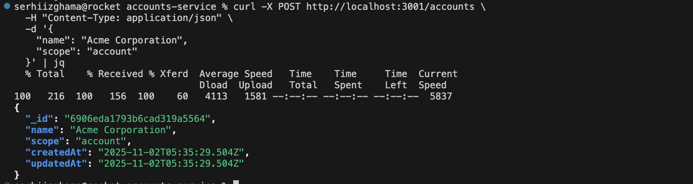
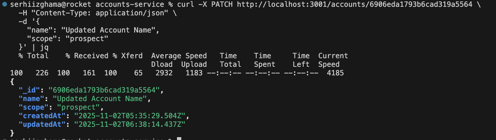
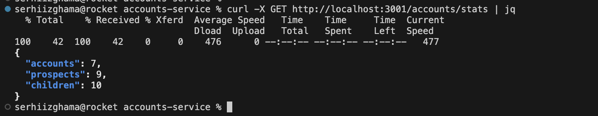
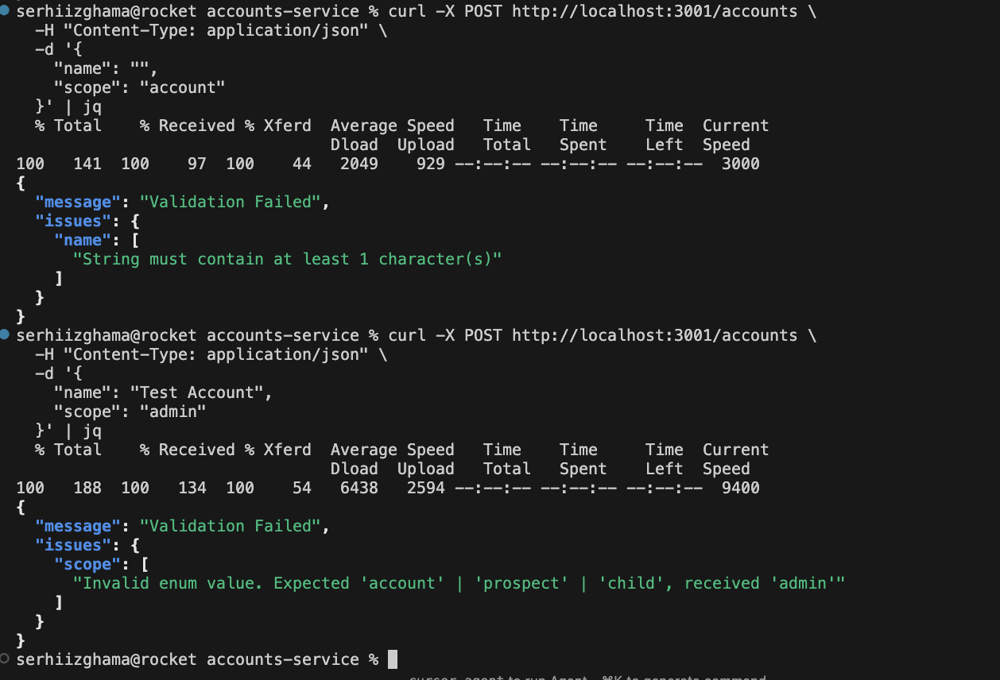
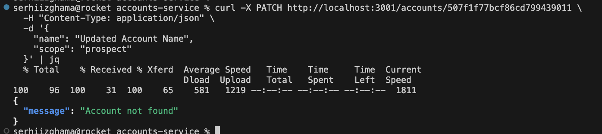
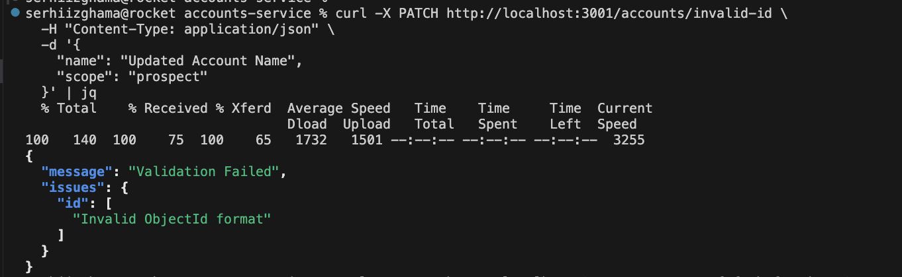

# Accounts Service

A RESTful API service built with Express.js and TypeScript for managing accounts in MongoDB. This service provides endpoints for creating, updating, and retrieving statistics about accounts with different scopes (account, prospect, child).

## Tech Stack

- **Runtime**: Node.js 22+
- **Language**: TypeScript
- **Framework**: Express.js
- **Database**: MongoDB (using native driver)
- **Validation**: Zod

## Getting Started

### Prerequisites

- Docker and Docker Compose
- MongoDB Shell (`mongosh`) - required for seeding data

### Running with Docker

The easiest way to run the service is using Docker Compose, which sets up both the MongoDB database and the application:

```bash
docker-compose up -d
```

This will:
- Start MongoDB on port `27018`
- Build and start the application on port `3001` (configurable via `PORT` environment variable)
- Set up persistent data volumes for MongoDB

### Environment Variables

Create a `.env` file in the root directory with the following variables:

```env
MONGO_USER=admin
MONGO_PASSWORD=admin123
MONGO_DB=accounts-service
PORT=3001
```

Default values will be used if not specified.

### Seeding Fake Data

To populate the database with sample accounts data, use the seed script:

```bash
npm run seed
```

This script will:
- Connect to your MongoDB instance
- Clear existing accounts
- Insert mock data with different scopes (accounts, prospects, children)

**Note**: Make sure MongoDB is running before executing the seed script.

## API Endpoints

### 1. Create Account

Create a new account in the database.

- **Method**: `POST`
- **URL**: `/accounts`
- **Request Body**:
  ```json
  {
    "name": "Account Name",
    "scope": "account"
  }
  ```
- **Request Headers**: `Content-Type: application/json`
- **Response**: Account object with `_id`, `name`, `scope`, `createdAt`, and `updatedAt`
- **Status Codes**:
  - `201 Created` - Account created successfully
  - `400 Bad Request` - Validation error
  - `500 Internal Server Error` - Server error

**cURL Example**:
```bash
curl -X POST http://localhost:3001/accounts \
  -H "Content-Type: application/json" \
  -d '{
    "name": "Acme Corporation",
    "scope": "account"
  }' | jq
```

**Response Example**:


---

### 2. Update Account

Update an existing account by ID.

- **Method**: `PATCH`
- **URL**: `/accounts/:id`
- **URL Parameters**: 
  - `id` (string) - MongoDB ObjectId of the account to update
- **Request Body**:
  ```json
  {
    "name": "Updated Name",
    "scope": "prospect"
  }
  ```
- **Request Headers**: `Content-Type: application/json`
- **Response**: Updated account object
- **Status Codes**:
  - `200 OK` - Account updated successfully
  - `400 Bad Request` - Validation error or invalid ObjectId format
  - `404 Not Found` - Account not found
  - `500 Internal Server Error` - Server error

**cURL Example**:
```bash
curl -X PATCH http://localhost:3001/accounts/507f1f77bcf86cd799439011 \
  -H "Content-Type: application/json" \
  -d '{
    "name": "Updated Account Name",
    "scope": "prospect"
  }' | jq
```

**Response Example**:


---

### 3. Get Account Statistics

Retrieve count statistics for each account scope.

- **Method**: `GET`
- **URL**: `/accounts/stats`
- **Response**: Statistics object with counts for each scope
- **Status Codes**:
  - `200 OK` - Statistics retrieved successfully
  - `500 Internal Server Error` - Server error

**cURL Example**:
```bash
curl -X GET http://localhost:3001/accounts/stats | jq
```

**Response Example**:


---

## Error Responses

### Validation Error (400 Bad Request)

When validation fails, the API returns detailed error messages:

```json
{
  "message": "Validation Failed",
  "issues": {
    "name": ["String must contain at least 1 character(s)"],
    "scope": ["Invalid enum value. Expected 'account' | 'prospect' | 'child', received 'admin'"]
  }
}
```

**cURL Example**:
```bash
# Validation error - empty name
curl -X POST http://localhost:3001/accounts \
  -H "Content-Type: application/json" \
  -d '{
    "name": "",
    "scope": "account"
  }' | jq

# Validation error - invalid scope
curl -X POST http://localhost:3001/accounts \
  -H "Content-Type: application/json" \
  -d '{
    "name": "Test Account",
    "scope": "admin"
  }' | jq
```

**Validation Error Example**:


---

### Account Not Found (404 Not Found)

When attempting to update an account that doesn't exist:

```json
{
  "message": "Account not found"
}
```

**cURL Example**:
```bash
curl -X PATCH http://localhost:3001/accounts/507f1f77bcf86cd799439011 \
  -H "Content-Type: application/json" \
  -d '{
    "name": "Updated Account Name",
    "scope": "prospect"
  }' | jq
```

**Not Found Error Example**:


---

### Invalid ObjectId (400 Bad Request)

When providing an invalid MongoDB ObjectId format:

```json
{
  "message": "Validation Failed",
  "issues": {
    "id": ["Invalid ObjectId format"]
  }
}
```

**cURL Example**:
```bash
# Invalid ObjectId format - too short
curl -X PATCH http://localhost:3001/accounts/invalid-id \
  -H "Content-Type: application/json" \
  -d '{
    "name": "Updated Account Name",
    "scope": "prospect"
  }' | jq
```

**Invalid ID Error Example**:


---

## Account Model

Accounts have the following structure:

- `_id` (ObjectId) - MongoDB unique identifier
- `name` (string) - Account name (required, min 1 character)
- `scope` (enum) - Account scope: `"account"`, `"prospect"`, or `"child"`
- `createdAt` (Date) - Creation timestamp (auto-generated)
- `updatedAt` (Date) - Last update timestamp (auto-generated, required)

**Note**: 
- `createdAt` and `updatedAt` are automatically managed by the service
- `createdAt` cannot be modified on update
- `updatedAt` cannot be set on create
- `scope` must be one of the allowed enum values

## Development

### Local Development

For local development without Docker:

```bash
npm install
npm run dev
```

This will start the development server with hot reload.

### Building

To build the TypeScript code:

```bash
npm run build
```

### Production Start

```bash
npm start
```

## License

ISC
